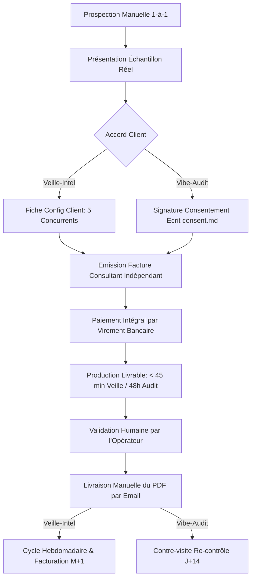
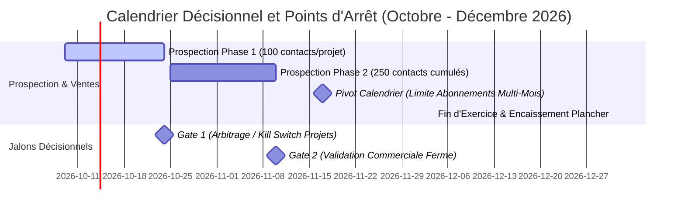

# PRD Unifié : Veille-Intel & Vibe-Audit

---

## 1. Résumé exécutif

Ce document cadre le développement et la validation commerciale de deux micro-services B2B opérés par Kreesten (Abomey-Calavi, Bénin) sous contrainte stricte de zéro dépense et zéro salarié, jusqu'au 31 décembre 2026.
Le premier volet, **Veille-Intel**, propose un abonnement hebdomadaire de veille concurrentielle en marque blanche (399 € à 499 €/mois) vendu à des agences marketing françaises.
Le second volet, **Vibe-Audit**, propose un audit de sécurité express en 48 h (99 € à 399 €) pour fondateurs francophones d'applications conçues avec des assistants IA (Lovable, Bolt, Cursor).
Tous les paiements s'effectuent par virement bancaire avant livraison (comptes Moneco ou Ecobank) sans intégration de passerelle payante.
L'objectif est d'atteindre un plancher de 1 000 000 FCFA (~1 524 €) et une cible de 2 000 000 FCFA (~3 049 €) encaissés avant le 31 décembre 2026.
La démarche repose sur deux jalons éliminatoires stricts (24 octobre et 10 novembre) pour tuer sans délai tout projet ne démontrant pas d'attraction commerciale réelle.

---

## 2. Objectifs

### 2.1 Objectifs financiers et règle de calendrier
- **Taux de change fixe de référence :** 1 € = 655,957 FCFA.
- **Plancher financier :** 1 000 000 FCFA (soit 1 524,49 €, arrondi à 1 525 €).
- **Cible financière :** 2 000 000 FCFA (soit 3 048,98 €, arrondi à 3 049 €).
- **Règle de calendrier non négociable :** Tout premier encaissement d'abonnement mensuel (Veille-Intel) intervenant après le 17 novembre 2026 ne génère qu'une seule mensualité avant la clôture du 31 décembre 2026. Les signatures tardives ne permettent pas l'accumulation de récurrence.
- **Déclinaison des ventes requises pour atteindre le plancher (1 525 €) :**
  - *Scénario Veille-Intel seul :* Exige 4 mensualités à 399 €. Compte tenu de la règle du 17 novembre, cela impose la signature d'au moins **2 agences clientes avant le 17 novembre** (2 agences × 2 mensualités nov./déc. = 4 mensualités = 1 596 € / 1 046 907 FCFA).
  - *Scénario Vibe-Audit seul :* Exige **8 clients** (2 pilotes à 99 € + 6 audits standards à 249 € = 1 692 € / 1 109 879 FCFA).
  - *Scénario Combiné :* 1 agence Veille signée avant le 17 novembre (2 mensualités = 798 €) + 1 pilote Vibe-Audit (99 €) + 3 audits standards Vibe-Audit (747 €) = 1 644 € (1 078 393 FCFA).
- **Déclinaison pour la cible (3 049 €) :**
  - *Scénario Veille-Intel seul :* 8 mensualités à 399 € (ou 7 à 499 €), exigeant 4 agences signées avant mi-novembre.
  - *Scénario Vibe-Audit seul :* ~14 clients (déclaré non réaliste en parallèle dans le contexte initial).
  - *Scénario Combiné optimal :* 2 agences Veille (4 mensualités = 1 596 €) + 2 pilotes Audit (198 €) + 5 audits standards (1 245 €) = 3 039 € (~2 M FCFA).

### 2.2 Objectifs produit
- **Veille-Intel :** Livrer un rapport PDF hebdomadaire marque blanche en moins de 45 minutes de travail humain par client, sans aucune affirmation dépourvue d'URL et de date de capture.
- **Vibe-Audit :** Livrer un rapport d'audit pédagogique sous 48 h ouvrées, 100 % reproductible manuellement, avec prompts de correction prêts à coller et refus catégorique d'exécution sans consentement écrit formel.

### 2.3 Objectifs d'apprentissage et de positionnement
- Valider la capacité d'un opérateur indépendant au Bénin à vendre des prestations à haute valeur ajoutée à des décideurs français.
- Renforcer les compétences pratiques en audit de sécurité applicative web et configuration cloud (Supabase, RLS, gestion des secrets) en vue d'une trajectoire de RSSI dans la finance.

---

## 3. Clients cibles et personas

### 3.1 Volet Veille-Intel
- **Acheteur :** Dirigeant ou associé d'une agence marketing, SEO, growth ou contenu B2B en France (effectif : 2 à 20 personnes).
  - *Motivation :* Augmenter son revenu moyen par client (ARPU) et fidéliser son portefeuille en vendant une veille stratégique récurrente (ex. 600 € à 800 €/mois) sans supporter le coût fixe d'un analyste junior (salaire chargé français > 2 500 €/mois).
  - *Frein principal :* Peur de livrer un rapport de mauvaise qualité ou halluciné qui détruirait la crédibilité de l'agence auprès de son client final.
- **Utilisateur (Opérateur agence) :** Chef de projet ou Account Manager en agence.
  - *Besoin :* Recevoir le lundi matin un livrable fini, propre, 100 % marque blanche, qu'il peut transférer ou présenter en 10 minutes à son client sans retouche graphique.
- **Prescripteur :** Le client final de l'agence (PME/ETI ou startup B2B), demandeur de visibilité sur les mouvements de ses concurrents.

### 3.2 Volet Vibe-Audit
- **Acheteur et Utilisateur unique :** Fondateur ou porteur de projet non technique francophone ayant assemblé une application web avec Lovable, Bolt, Cursor ou v0.
  - *Profil :* Profil métier, marketing ou produit ayant réussi à lancer son MVP sans écrire de code traditionnel, mais dont l'application commence à enregistrer de vrais utilisateurs ou à encaisser des paiements.
  - *Motivation :* Peur sourde de la faille bête (fuite de base de données, vol de clés d'API) pouvant tuer le projet ou engager sa responsabilité personnelle.
  - *Frein principal :* Conviction initiale qu'un outil d'IA générative "a déjà tout géré" ou qu'un simple prompt "audite ma sécurité" suffit.

---

## 4. Problème et alternatives actuelles

### 4.1 Veille-Intel
- **Problème :** Réaliser une veille sérieuse est chronophage (2 à 4 heures par client chaque semaine pour inspecter manuellement les changements de tarifs, articles de blog, offres d'emploi). Les agences abandonnent souvent la veille après 3 semaines faute de régularité.
- **Alternatives actuelles et limites :**
  - *SaaS de monitoring automatisé (ex. Visualping à 10-14 $/mois individuel ou 100-140 $/mois équipe [Source : visualping.io, capturé en oct. 2026] ; Hexowatch à partir de 29 $/mois [Source : hexowatch.com, capturé en oct. 2026]) :* Ne fournissent que des alertes de changement de pixels ou de code brut sans contextualisation métier, sans rédaction française prête à l'emploi et sans marque blanche native pour agences.
  - *Plateformes d'intelligence concurrentielle d'entreprise (ex. Crayon, Klue) :* Tarifs annuels prohibitifs (> 10 000 $/an), inaccessibles pour les agences de 2 à 20 personnes.
  - *IA gratuite (ChatGPT, Perplexity) :* Incapable de comparer l'état N par rapport à l'état N-1 à date précise ; hallucinations fréquentes de dates ou d'anciennes offres promotionnelles ; aucun format de rapport d'agence.
  - *Faire en interne :* Coût d'opportunité trop élevé pour les consultants de l'agence.

### 4.2 Vibe-Audit
- **Problème :** Les plateformes de génération assistée par IA (notamment Lovable sur Supabase) génèrent du code fonctionnel rapidement mais créent des failles systémiques. L'incident documenté CVE-2025-48757 a démontré la prolifération de tables sans Row Level Security (RLS) ou dotées de politiques `USING (true)` laissant les données en lecture/écriture libre à toute personne disposant de la clé anonyme publique [Source : Hard2Bit Security / CVE-2025-48757, analysé en oct. 2026].
- **Alternatives actuelles et limites :**
  - *IA gratuite en chat :* Souffre du biais de complaisance. Elle valide le code qu'elle a elle-même conçu et ne peut pas interroger l'état réel de la base de données en production ni inspecter les variables réseau réelles.
  - *Sociétés d'audit de sécurité / Pentest traditionnelles :* Forfaits de 2 000 € à 10 000 €, totalement hors de portée d'un solopreneur pré-revenu.
  - *Scanners de code automatiques (ex. Sonar, Snyk) :* Rapports jargonnants, orientés développeurs chevronnés, sans explications pour fondateurs non techniques et sans prompts de correction adaptés.

---

## 5. Proposition de valeur et différenciation (Formulées de façon testable)

| Dimension | Veille-Intel | Vibe-Audit |
| :--- | :--- | :--- |
| **Proposition de valeur** | « Déléguez une veille concurrentielle hebdomadaire vérifiée à la main pour vos clients, livrée le lundi en marque blanche pour 399 €/mois. » | « Protégez votre application générée par IA en 48 h : détection des failles critiques (Supabase/RLS, secrets) avec les prompts exacts pour les réparer, pour 249 €. » |
| **Différenciateur 1 (Testable)** | **100 % vérifiable :** Chaque signal comporte son URL source et sa date de capture. Zéro hallucination : si aucun concurrent ne bouge, le rapport l'indique explicitement. | **Zéro faux positif :** Chaque constat est reproduit manuellement par l'opérateur avant inclusion dans le rapport. |
| **Différenciateur 2 (Testable)** | **Zéro temps d'intégration :** Livrable PDF direct sans mention de marque ni configuration logicielle requise côté agence. | **Actionnabilité immédiate :** Chaque faille est accompagnée d'un prompt prêt à coller dans l'outil d'IA d'origine pour appliquer le correctif en 5 minutes. |
| **Différenciateur 3 (Testable)** | **Neutralité & Confidentialité Totale :** Traitement 100 % local et déterministe, zéro transmission de données à des APIs externes. | **Sécurité éthique absolue :** Aucun scan sans accord écrit (`consent.md`) et aucun test intrusif destructeur. |

---

## 6. Offre, prix, inclusions et exclusions

### 6.1 Grille tarifaire officielle
- **Veille-Intel :**
  - *Tarif Pionnier (3 premiers clients agences) :* **399 € HT / mois** (sans engagement).
  - *Tarif Standard (à partir du 4ᵉ client) :* **499 € HT / mois**.
  - *Règle stricte :* **Aucun pilote gratuit.** La démonstration de valeur s'effectue via un rapport d'exemple complet, jamais par une période offerte.
- **Vibe-Audit :**
  - *Tarif Pilote (2 premiers clients) :* **99 € HT** (en échange d'un retour d'expérience et d'un témoignage exploitable).
  - *Tarif Standard :* **249 € HT** (livraison sous 48 h ouvrées).
  - *Tarif Restitution :* **399 € HT** (rapport 48 h + visio d'explication pédagogique de 30 minutes).

### 6.2 Ce qui est inclus
- **Veille-Intel :**
  - Surveillance hebdomadaire de jusqu'à 5 concurrents définis par client.
  - 5 à 10 signaux qualifiés par semaine (pricing, nouvelles fonctionnalités, messaging, recrutement, annonces).
  - Comparaison différentielle N vs N-1.
  - Rapport PDF de 3 à 6 pages rédigé en français soigné, 100 % marque blanche.
  - 3 recommandations d'actions concrètes par signal.
  - Historique des semaines précédentes consultable.
- **Vibe-Audit :**
  - 7 contrôles de sécurité : (1) secrets dans le code et l'historique git, (2) politiques RLS Supabase et tables non protégées, (3) vérification autorisation client vs serveur, (4) exposition de clés privées dans le navigateur, (5) audit des dépendances déclarées, (6) en-têtes HTTP de sécurité/CORS/TLS sur l'URL publique consentie, (7) validation des webhooks de paiement.
  - Rapport PDF classé par gravité (Critique, Élevé, Moyen, Faible) avec preuves matérielles.
  - Prompts de correction prêts à copier-coller pour Lovable, Bolt ou Cursor.
  - Liste explicite des éléments hors périmètre non testés.
  - Re-contrôle de validation offert à J+14 pour vérifier la bonne application des correctifs.

### 6.3 Ce qui est expressément exclu
- Réunions de travail ou recherche documentaire sur mesure non prévue (Veille-Intel).
- Tests d'intrusion actifs, attaques en déni de service, exploitation de vulnérabilités, extraction de données réelles (Vibe-Audit).
- Audit d'applications mobiles natives iOS/Android ou conformité RGPD intégrale (Vibe-Audit).
- Facilités de paiement ou paiement par carte bancaire / plateformes tierces.

---

## 7. Parcours client de bout en bout

1. **Découverte :** Prise de contact ultra-ciblée, manuelle et personnalisée par email (10 contacts/jour/projet), respectant le droit d'opposition.
2. **Échantillon :** Démonstration par la preuve via un échantillon concret (rapport exemple sur un segment d'agences françaises ou audit exemple d'une app test représentative).
3. **Cadrage & Consentement :**
   - Veille : Recueil de la liste des 5 concurrents et des URLs publiques.
   - Audit : Réception impérative du fichier `consent/<client>.md` signé et vérifié avant toute opération.
4. **Paiement :** Envoi d'une facture émise par Kreesten en tant que consultant indépendant (Mention TVA : [À VALIDER PAR UN EXPERT-COMPTABLE AVANT LA PREMIÈRE FACTURE]. Ne pas utiliser l'article 293 B.). Règlement exclusif par virement SEPA (compte Moneco) ou compte Ecobank avant exécution de la prestation.
5. **Livraison :** Génération semi-automatisée, vérification humaine manuelle de chaque ligne, et envoi du PDF par email directement par l'opérateur.
6. **Fidélisation / Clôture :** Facturation mensuelle récurrente pour la veille ; proposition du re-contrôle gratuit à J+14 pour l'audit.

---

## 8. Exigences fonctionnelles du MVP (Priorités MoSCoW)

### Volet Veille-Intel
- **FR-001 [Must Have] :** Le système doit charger un fichier de configuration client au format YAML spécifiant l'identifiant client et jusqu'à 5 URLs cibles par concurrent.
- **FR-002 [Must Have] :** Le fetcher doit interroger le fichier `robots.txt` du domaine cible et refuser toute extraction d'une page interdite (`Disallow`).
- **FR-003 [Must Have] :** Le fetcher doit appliquer une temporisation minimale de 5 secondes entre deux requêtes successives vers le même domaine et utiliser un User-Agent transparent.
- **FR-004 [Must Have] :** Le système doit archiver le contenu textuel brut horodaté dans une base locale SQLite pour constituer les instantanés (snapshots).
- **FR-005 [Must Have] :** Le module différentiel doit calculer le delta textuel précis entre la semaine N et la semaine N-1. Si aucun changement n'est constaté, le livrable doit mentionner explicitement « Aucun changement observé » sans inventer de signal.
- **FR-006 [Must Have] :** L'analyse assistée doit séparer rigoureusement les faits (citations exactes, chiffres modifiés) des interprétations stratégiques et formuler 3 recommandations d'actions.
- **FR-007 [Must Have] :** Le moteur de rendu doit exporter un PDF soigné de 3 à 6 pages exempt de toute mention de marque technique ou d'outil sous-jacent.
- **FR-008 [Should Have] :** Génération locale et déterministe des canevas de signaux (faits bruts, dates, URLs, deltas textuels) sans aucune dépendance d'API LLM externe.
- **FR-009 [Could Have] :** Support d'un fetcher headless (Playwright) activé uniquement sur commande explicite pour les pages publiques requérant du JavaScript.

### Volet Vibe-Audit
- **FR-010 [Must Have] :** Le sas de sécurité (`consent_gate`) doit vérifier l'existence, la complétude et la validité temporelle du fichier `consent/<client>.md` avant d'autoriser l'exécution de tout outil d'analyse.
- **FR-011 [Must Have] :** Le scanner de secrets doit détecter les clés d'API, tokens privés et identifiants sensibles dans les fichiers sources et dans l'historique des commits git, et les masquer systématiquement dans les sorties.
- **FR-012 [Must Have] :** L'analyseur SQL doit examiner les fichiers de schéma et de migrations (ex. Supabase) pour identifier les tables sans Row Level Security (`ENABLE ROW LEVEL SECURITY`) ou avec des politiques permissives `true`.
- **FR-013 [Must Have] :** L'analyseur frontend doit vérifier l'absence de clés de service (`service_role` ou équivalent) dans les fichiers publics et variables d'environnement exposées au navigateur.
- **FR-014 [Must Have] :** Le scanner de dépendances doit exécuter localement les vérifications statiques (`npm audit` ou `pip-audit`) et consigner les vulnérabilités publiques connues.
- **FR-015 [Must Have] :** L'analyseur réseau passif doit relever les en-têtes HTTP de sécurité (CSP, HSTS, X-Content-Type-Options) et la configuration CORS de l'URL consentie sans aucune injection de charge active.
- **FR-016 [Must Have] :** Le moteur de génération de rapport doit produire pour chaque constat confirmé : la preuve matérielle reproductible, le niveau de risque, l'impact métier et le prompt de correction prêt à coller dans l'outil d'IA.
- **FR-017 [Must Have] :** Le rapport doit intégrer une section obligatoire listant les périmètres techniques non testés.

---

## 9. Exigences non fonctionnelles

- **NFR-001 (Légalité et Éthique) :** Aucune analyse sans consentement écrit préalable. Scraping limité aux données publiques en lecture seule sans contournement de protections (CAPTCHA, anti-bot).
- **NFR-002 (Confidentialité stricte) :** Aucun code client ni donnée personnelle d'agence ne doit être commité dans git ni transmis à un service d'API tiers. Traitement 100 % local et déterministe. Les fichiers clients et dépôts analysés doivent être détruits au plus tard 30 jours après remise du livrable.
- **NFR-003 (Zéro Dépense d'Infrastructure) :** Coût récurrent de fonctionnement = 0,00 €. Utilisation exclusive d'outils open-source locaux sans aucune clé d'API ni dépendance de service cloud tiers.
- **NFR-004 (Efficacité Opératoire) :** La production et la validation d'un rapport de veille hebdomadaire ne doivent pas excéder 45 minutes de travail pour l'opérateur. La réalisation d'un audit complet ne doit pas excéder 3 heures de travail cumulé sur les 48 h.
- **NFR-005 (Intégrité des Données) :** 100 % des affirmations contenues dans les rapports de veille doivent être traçables par une URL publique active et une date de capture vérifiable.

---

## 10. Métriques de succès et points d'arrêt (Chiffrés et datés)

### Jalon 1 : Gate 1 (Date ferme : 24 octobre 2026)
- **Objectif d'engagement :** ~100 contacts personnalisés envoyés par projet (~200 contacts au total).
- **Seuil de succès minimal :** Au moins **5 réponses formulées** ET **2 appels ou visios qualifiés** par projet.
- **Règle d'arbitrage décidée :** Si un projet franchit le seuil et que l'autre échoue, **le projet défaillant est immédiatement arrêté (Kill)**. L'opérateur réalloue 100 % de son temps (20 contacts/jour) sur le projet validé. Si les deux échouent, révision radicale du positionnement ou arrêt global.

### Jalon 2 : Gate 2 (Date ferme : 10 novembre 2026)
- **Objectif d'engagement :** ~250 contacts cumulés par projet actif.
- **Seuil de succès minimal :** Au moins **1 vente ferme encaissée sur compte bancaire** (virement reçu avant livraison).
- **Règle d'arbitrage :** Si 0 vente encaissée au 10 novembre malgré 250 contacts qualifiés, clôture immédiate et définitive du projet.

### Jalon de Calendrier Financier (17 novembre 2026)
- Seuil limite pour l'acquisition d'abonnements Veille-Intel générant deux mensualités avant le 31 décembre.

---

## 11. Registre d'hypothèses

| Réf. | Énoncé de l'Hypothèse | Risque si fausse | Test le moins cher | Date de décision |
| :--- | :--- | :--- | :--- | :--- |
| **HYP-01** | Des agences marketing françaises sont prêtes à payer 399 €/mois pour de la veille blanche sans rencontre physique. | Projet Veille-Intel non viable ; effort commercial stérile. | 100 cold emails personnalisés avec rapport d'exemple ciblé. | 24 octobre 2026 |
| **HYP-02** | Des fondateurs d'apps IA sont prêts à payer 249 € pour un audit humain plutôt que de se fier à un prompt gratuit. | Offre Vibe-Audit invendable auprès des créateurs no-code. | 100 approches personnalisées de fondateurs actifs sur les réseaux. | 24 octobre 2026 |
| **HYP-03** | Les agences françaises acceptent de régler des factures de consultant indépendant émises par Kreesten (Bénin). | Blocage administratif ou comptable au moment de l'encaissement. | Présentation anticipée des modalités de facturation lors des premiers appels. | 24 octobre 2026 |
| **HYP-04** | Le compte Moneco permet de recevoir des virements professionnels SEPA français sans rejet ni délai excessif. | Impossibilité matérielle d'encaisser les fonds en euros. | Réalisation d'un virement test ou vérification des conditions contractuelles Moneco. | 15 octobre 2026 |
| **HYP-05** | Un rapport de veille de haute qualité peut être finalisé et vérifié en moins de 45 minutes humaines. | Explosion de la charge de travail de l'opérateur et incapacité à scaler. | Chronométrage de la production du rapport d'exemple initial. | 12 octobre 2026 |
| **HYP-06** | Les fondateurs d'applications acceptent de signer un accord écrit `consent.md` avant toute analyse. | Blocage dans le funnel de conversion de Vibe-Audit. | Soumission du protocole de consentement aux 5 premières marques d'intérêt. | 24 octobre 2026 |

---

## 12. Risques et mitigations

1. **Risque de confiance lié à l'éloignement géographique :**
   - *Mitigation :* Professionnalisme irréprochable des livrables, preuves tangibles, échantillon d'amorce complet fourni dès le premier contact, présence d'un profil LinkedIn technique soigné.
2. **Risque de refus des factures d'un consultant particulier sans TVA :**
   - *Mitigation :* Facturation conforme mentionnant expressément la qualité de consultant indépendant avec Mention TVA : [À VALIDER PAR UN EXPERT-COMPTABLE AVANT LA PREMIÈRE FACTURE]. Ne pas utiliser l'article 293 B. et acceptation explicite du devis/facture avant tout démarrage.
3. **Risque de dépendance ou de rupture d'API externe :**
   - *Mitigation :* Suppression totale de l'API Gemini du code applicatif. Le moteur de traitement repose sur une logique déterministe locale pure (différentiel textuel, règles regex précises, gabarits de prompts et de correctifs structurés). Zéro risque de quota, zéro clé payante.
4. **Risque juridique lié à l'analyse de code tiers (Vibe-Audit) :**
   - *Mitigation :* Blocage technique systématique de l'outil si le fichier `consent/<client>.md` est absent ; analyse en lecture seule ; destruction des archives sous 30 jours.
5. **Risque de dispersion de l'opérateur sur deux fronts :**
   - *Mitigation :* Application mécanique de la règle d'arbitrage au 24 octobre (suppression du projet le moins performant pour doubler la cadence sur le projet gagnant).

---

## 13. Hors périmètre

- Développement d'une interface web SaaS, d'un espace client ou d'un dashboard en ligne.
- Mise en place d'un système d'abonnement bancaire automatisé (carte bleue, prélèvement SEPA automatisé).
- Envoi automatique ou programmatique d'emails à des listes de prospects (cold mailing de masse).
- Audits d'intrusion offensifs, tests d'injection SQL destructifs, ou tests de charge (DDoS).
- Prestations de développement ou d'intégration de correctifs pour le compte du client (l'opérateur fournit les prompts et recommandations, le client applique).

---

## 14. Questions ouvertes

1. **Délai moyen d'exécution des virements SEPA d'entreprises vers Moneco :** Quel est le délai effectif de compensation constaté entre l'ordre de virement d'une agence française et la disponibilité des fonds sur l'application Moneco ? (À valider lors du premier virement test).
2. **Plafond d'encaissement annuel ou mensuel du compte Moneco :** Existe-t-il des limites de conformité KYC sur les flux professionnels entrants pour un compte ouvert depuis le Bénin ?
3. **Seuil de tolérance des agences au format PDF statique :** Les agences demanderont-elles à terme un export éditable (Notion, Google Docs) pour réinjecter les signaux dans leurs propres présentations ? (Point à observer lors des 2 premiers appels).
